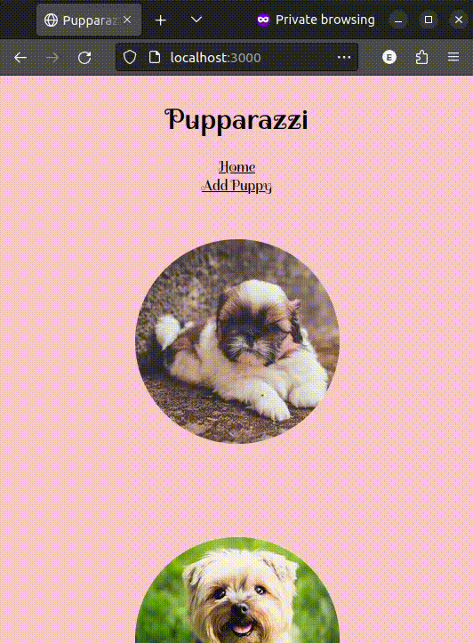

# Pupparazzi

Pupparazz is a pet diary to manage and edit profiles of dogs.
This was my first app using full-stack.

## Setup

### Installation and migrations

- [ ] Install packages, run migrations and seeds, and start the dev server with `npm run dev`

  ```
  npm install
  npm run dev
  ```


### Demo

